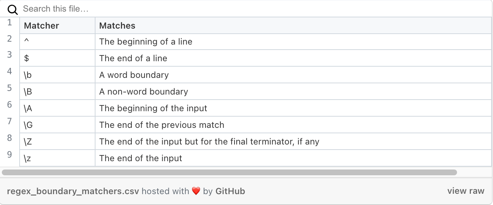

# Regex Tutorial: Matching an Email Address

There are many methods in JavaScript to help us find what we're looking for; a specific word, a specific phrase, etc. But what if we need a more dynamic solution? It's one thing to search with "cntrl+F" to find a word we know exists (such as a common email provider,) but there is a more encompassing solution.

## Summary

In this tutorial, we will be breaking down the below regular expression (also known as "regex") for finding an email address. 

```
/^([a-z0-9_\.-]+)@([\da-z\.-]+)\.([a-z\.]{2,6})$/
```

While the above regex doesn't appear to be much to look at now, let's dive into the ins and out of a more dynamic way to search for and manipulate an email address.

## Table of Contents

- [Regex Components](#regex-components)
- [Anchors](#anchors)
- [Quantifiers](#quantifiers)
- [OR Operator](#or-operator)
- [Character Classes](#character-classes)
- [Flags](#flags)
- [Grouping and Capturing](#grouping-and-capturing)
- [Bracket Expressions](#bracket-expressions)
- [Greedy and Lazy Match](#greedy-and-lazy-match)
- [Boundaries](#boundaries)
- [Back-references](#back-references)
- [Look-ahead and Look-behind](#look-ahead-and-look-behind)

## Regex Components

As stated above, the regex below is designed to assist in searching for and manipulating an email address. Regex isa formatted as a literal wrapped in slash characters. Let's take a look at the building blocks that make up our regex.

```
/^([a-z0-9_\.-]+)@([\da-z\.-]+)\.([a-z\.]{2,6})$/
```


### Anchors

Anchors in regex are characters that are not a part of the matching criteria for the characters. Anchors serve to match a position before, after or between the characters. the character ^ matches the position before the first character in a string, identifying that the string begins with the charachters that follow it, and the character $ matches the position directly after the last character in a string and signify that the string contains the characters that preceed it. 

Below is a table notating common anchors.


For our purposes, we can identify ^ and $ as our anchors for the beginning and ending of the string respectively:

```
/^([a-z0-9_\.-]+)@([\da-z\.-]+)\.([a-z\.]{2,6})$/
```

### Quantifiers

Quantifiers tell the regex how many times variables occur in matching strings. 
In our email address regex, we can break it down into groups:

#### Capture Group 1

Here we see the + symbol, a quantifier that matches the previous token at least once but up to unlimited times. This means that the first part of our email address (before the @) contains characters from the list in parenthesis, and could occur many times. 
```
([a-z0-9_\.-]+)
```
#### Capture Group 2

Once again, we see the + symbol, a quantifier that matches the previous token at least once but up to unlimited times. This means that the second capture group contains exactly one @ symbol, and characters from the list in parenthesis, which could occur many times. 
```
@([\da-z\.-]+)
```
#### Capture Group 3

Finlly, we see {2,6} at the end of capture group 3. This tells the regex to search for characters within the brackets, but only between 2 to 6 times.

```
([a-z\.]{2,6})
```


### OR Operator

The OR Operator is signified by the | symbol. it allowes the regex to consider alternatives such as the name Jim for the name James. 

```
(James|Jim) Brown
```
The criteria above will search for both Jim and James Brown. The regex we are using today does not contain an OR Operator. 

### Character Classes


### Flags

### Grouping and Capturing

### Bracket Expressions

### Greedy and Lazy Match

### Boundaries

### Back-references

### Look-ahead and Look-behind

## Author

A short section about the author with a link to the author's GitHub profile (replace with your information and a link to your profile)
